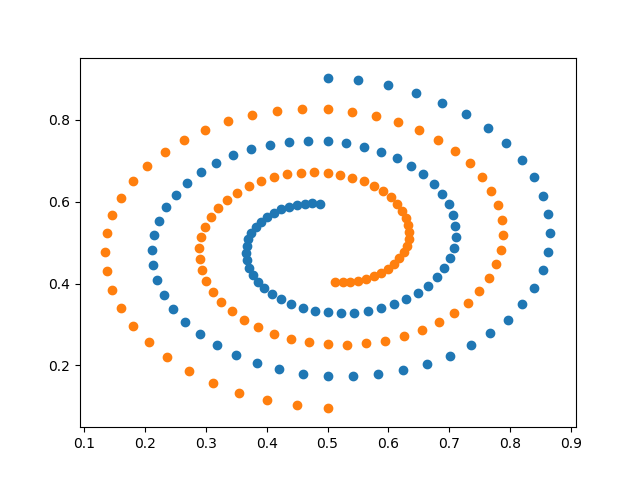
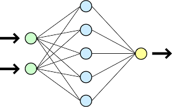

## Course Project for Topic A, B, C

### Environment

* python 3.7
* mxnet
* numpy
* matplotlib

### Task

Apply general FNN for binary spiral classification.

### Results

The results are in the **doc/results** directory

